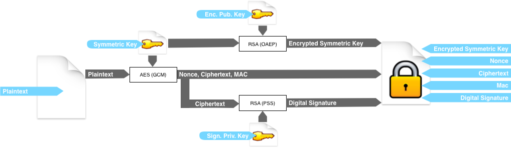
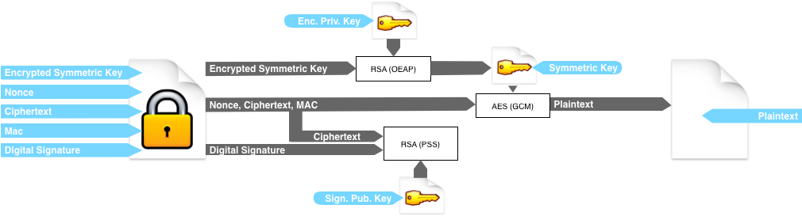

# Secure Container

these three following Python scripts allow you to create secure containers of personnal files, using two pairs of RSA keys. One for signing  and one for encrypt your data.

Encryption scheme : 



Decryption scheme : 




### Genkeys.py

Allow you to generate two pair of RSA keys of 2048 bits by default. Usage :

```sh
$ genkeys.py
```

or 

```sh
$ genkeys.py 4096
```

for 4096 bits key lenght.

### archive.py

Allow you to secure one or multiple files in a secure container. RSA keys must be presents in the same directory.

```sh
$ archive.py file1 file2 ...
```

This will create a encrypted JSON file in the same directory.

### unarchive.py

Allow you to open one or multiple secure containers. RSA keys must be presents in the same directory.

```sh
$ unarchive.py container1 ...
```

## Functionnality

   - Create a secure container using AES GCM algorithm and a 256 bits key
   - Encrypt the symetrical key with RSA (OAEP)
   - Sign encrypted data with RSA (PSS)

## Version

 - 1.0


## Prerequisites
 - pycrypto-2.7a1
 - Python3


## Improvements
 - The JSON secure container is about 20% bigger than original data.
 - Intermediate TAR file should be created in memory rather than on the disk.
 